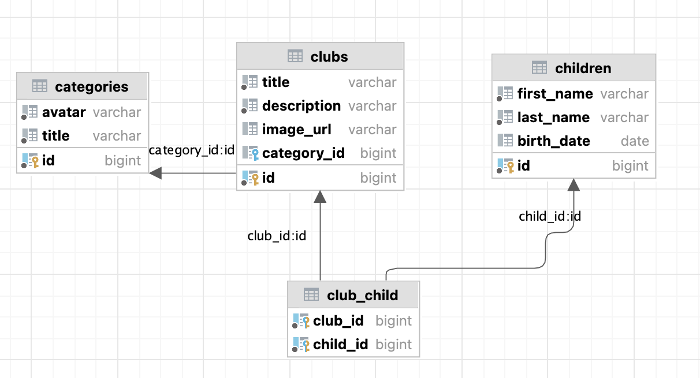

# Database and Testing Assignment

## Task

Rewrite tests in `src/test/java/database/ChildDBTest.java` as **parameterized tests** (JUnit 5):

- replace repetitive `@Test` methods with `@ParameterizedTest`;
- use appropriate parameter sources:
  - `@CsvSource` for simple input/expected value combinations;
  - `@MethodSource` for more complex cases (multiple objects, collections, edge cases);
  - `@NullSource` for `null` validation checks;
- keep coverage for both positive and negative scenarios of `ChildDB` methods (add, update, delete, search);
- assertions must align with schema constraints from `src/test/resources/init.sql`.

## Field Constraints (from `init.sql`)

### `categories`
- `id` - `bigint`, `generated always as identity`, `primary key`;
- `avatar` - `varchar`, `not null`;
- `title` - `varchar`, `not null`, `unique`.

### `club`
- `id` - `bigint`, `generated always as identity`, `primary key`;
- `title` - `varchar`, `not null`;
- `description` - `varchar`, `not null`;
- `image_url` - `varchar`, nullable;
- `category_id` - `int8`, `foreign key` -> `categories(id)` (nullable in the current schema).

### `child`
- `id` - `bigint`, `generated always as identity`, `primary key`;
- `first_name` - `varchar`, `not null`;
- `last_name` - `varchar`, `not null`;
- `birth_date` - `date`, nullable.

### `club_child`
- `club_id` - `int8`, `foreign key` -> `club(id)`;
- `child_id` - `int8`, `foreign key` -> `child(id)`;
- in the current schema, there is no explicit `primary key` or `unique` constraint for the pair (`club_id`, `child_id`).

## Acceptance Criteria

- `ChildDBTest` contains parameterized tests instead of duplicated `@Test` methods;
- tests explicitly validate field constraints and input rules listed above;
- `mvn test` runs successfully.
 
